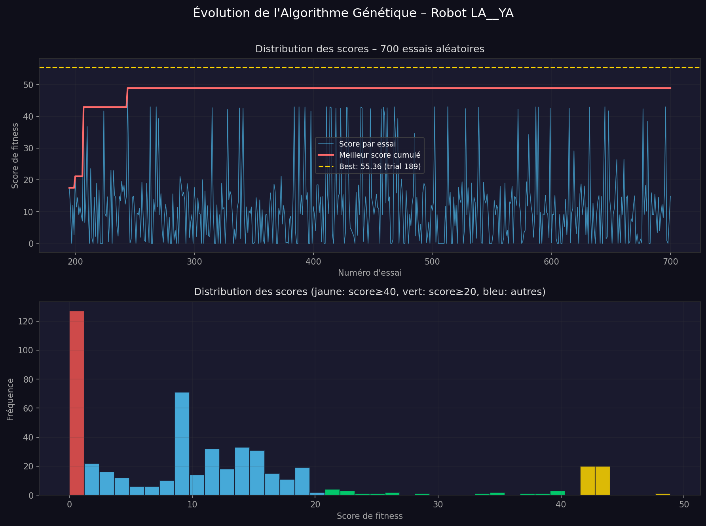
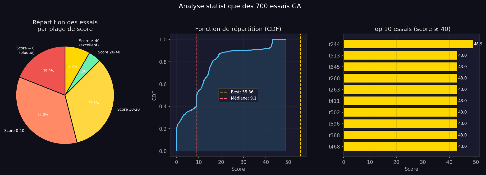
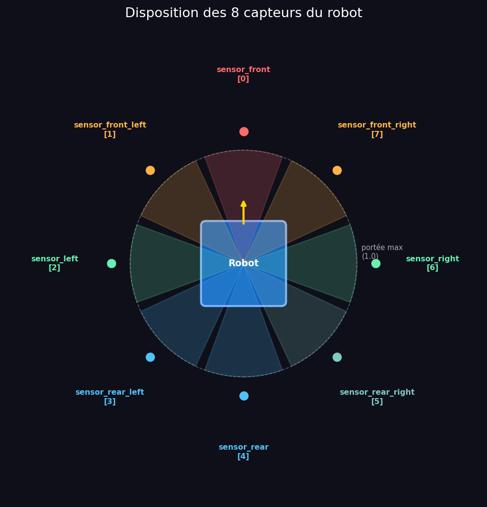
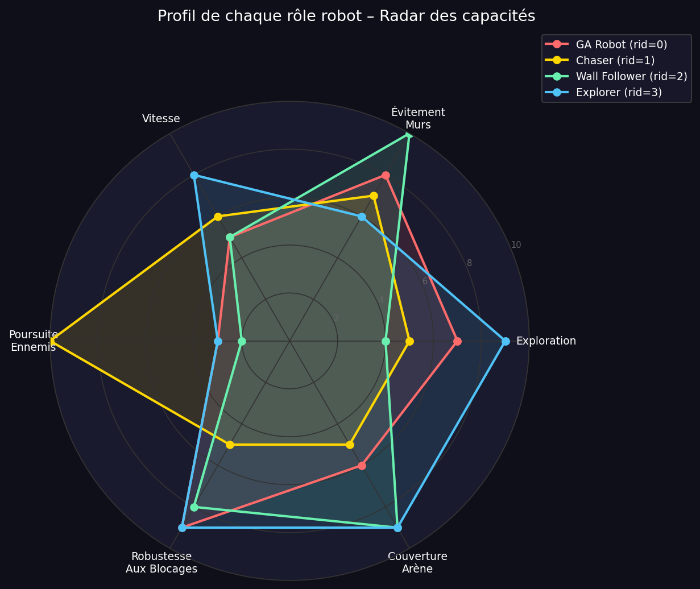
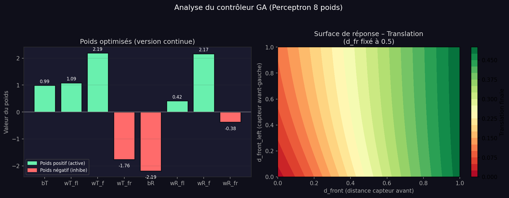

# 🤖 Paint Wars – Multi-Robot AI Agent

A competitive multi-robot AI agent for **Paint Wars**: two teams of 4 robots compete to paint as many cells as possible in a 100×100 arena. The team controlling the most cells at the end wins — a competitive twist on the classic multi-agent patrol problem.

---

## 🎓 Academic Context & Beyond

This project was developed as part of **LU3IN025 – AI & Games** at Sorbonne Université (2025), a course covering reactive robotics, evolutionary algorithms, and multi-agent systems.

The base assignment asked us to implement a robot controller using Braitenberg vehicles and a genetic algorithm. We went further in several directions:

- **Subsumption architecture** — rather than a single monolithic controller, we designed a 5-layer priority system inspired by Rodney Brooks' seminal work, where each layer can inhibit lower ones
- **4 specialized roles** — each robot plays a distinct strategic role (explorer, wall follower, enemy chaser, GA-optimized agent), enabling implicit team coordination without any communication
- **Compact memory engineering** — the project allows only one integer of memory per robot; we developed three different multi-field encoding schemes to pack mode, timer, and displacement trace into a single value, drawing inspiration from embedded systems bit-field packing
- **Perceptron weight analysis** — beyond just finding good weights, we analyzed *why* the optimal parameters work geometrically (intrinsic rotation bias, asymmetric obstacle response)
- **Full statistical analysis** — we ran 700 GA trials and produced a complete analysis of the score distribution, CDF, and weight response surface

The full technical report (in French) is included as `rapport_technique.docx`.

---

## 🏗 Architecture

Our strategy is built on a **5-layer subsumption architecture** combining multiple reactive behaviors:

```
┌─────────────────────────────────────────────────┐  HIGHEST PRIORITY
│  LAYER 4 – Anti-Collision (min_front < 0.10)    │  → Back up + turn
├─────────────────────────────────────────────────┤
│  LAYER 3 – GA Controller (8-weight Perceptron)  │  → tanh(w·s)
├─────────────────────────────────────────────────┤
│  LAYER 2 – Chaser (pursues enemies)             │  → sensor_team
├─────────────────────────────────────────────────┤
│  LAYER 1 – Wall Follower (hugs walls)           │  → TARGET_SIDE
├─────────────────────────────────────────────────┤
│  LAYER 0 – Explorer (extended Braitenberg)      │  LOWEST PRIORITY
└─────────────────────────────────────────────────┘
```

Each higher layer **inhibits** the output of all lower layers when activated, guaranteeing sub-1-tick response to emergencies.

### 4 Specialized Roles (assigned by `robot_id % 4`)

| rid | Role | Main behavior |
|-----|------|--------------|
| 0 | **GA Robot** | Single-layer perceptron + signed-memory unsticking |
| 1 | **Chaser** | Detects & pursues enemies via `sensor_team`, avoids walls |
| 2 | **Wall Follower** | Maintains distance `TARGET_SIDE=0.22` from nearest wall |
| 3 | **Explorer** | Braitenberg navigation + adaptive unsticking mode |

---

## 🧬 Genetic Algorithm Optimization

The **GA Robot (rid=0)** uses a perceptron whose weights were found by random search over {-1, 0, +1}⁸ (700 trials):

```python
translation = tanh(w0 + w1·d_fl + w2·d_f + w3·d_fr)
rotation    = tanh(w4 + w5·d_fl + w6·d_f + w7·d_fr)

# Best discrete individual (trial 189, score=55.36):
# [0, -1, -1, 1, 1, -1, 1, 0]

# Refined continuous version:
GA_Param = [0.992237, 1.086936, 2.191976, -1.764676,
           -2.191082, 0.416231, 2.168867, -0.378178]
```

**Weight interpretation:**
- `w2 = +2.19` → accelerates hard when the path ahead is clear
- `w4 = -2.19` → intrinsic rotation bias → prevents infinite straight lines
- `w3 = -1.76` → slows down if obstacle on the right → preferred left-side avoidance




---

## 🧠 Memory Engineering

Project constraint: **one single integer** per robot. We use compact multi-field encoding:

```python
# rid=0 (GA Robot) – signed timer
memory > 0  →  turn left for `memory` ticks
memory < 0  →  turn right for `|memory|` ticks

# rid=2 (Wall Follower) – stuck detector
memory = (displacement_trace * 100) + stuck_counter

# rid=3 (Explorer) – ternary encoding
memory = mode * 1_000_000 + timer * 1_000 + displacement_trace
#  mode  ∈ {0=normal, 1=unsticking}
#  timer ∈ [0, 30]
#  trace ∈ [0, 999]
```

This encoding technique is inspired by bit-field packing used in embedded systems programming.

---

## 📊 Sensor Layout



8 distance sensors evenly spaced around the robot (counter-clockwise, 0 = front). Each also provides `sensor_view[i]` (0=empty, 1=wall, 2=robot) and `sensor_team[i]` (team of detected robot).

---

## 🎯 Role Profiles



---

## 🔬 Perceptron Analysis



---

## 📁 Project Structure

```
.
├── robot_challenger_main.py     # 🎯 Our robot controller
├── robot.py                     # Base Robot class
├── robot_optimize.py            # Random search for GA weights (offline)
├── ga_weights_challenger.py     # Best discrete GA weights
├── best_GA.txt                  # Log of all 700 trials with scores
├── tetracomposibot.py           # Main simulator (do not modify)
├── arenas.py                    # Arena definitions (do not modify)
├── config_Paintwars.py          # Tournament configuration
├── robot_champion.py            # Reference opponent
├── config_TP1.py / config_TP2.py
├── go_tournament                # Shell script: run 10 matches
├── assets/                      # Charts and visuals
└── rapport_technique.docx       # Full technical report (French)
```

---

## 🚀 Running the Simulation

```bash
# Normal simulation (PyGame window)
python tetracomposibot.py config_Paintwars

# With arguments: <arena 0-4> <swap_start_position> <speed 0/1/2>
python tetracomposibot.py config_Paintwars 2 False 1

# Ultra-fast, no display
python tetracomposibot.py config_Paintwars 0 False 2
```

### Run the full tournament (10 matches)
```bash
sh go_tournament
```

### Dependencies
```bash
pip install pygame numba
# If numba is unavailable: use tetracomposibot_noOpt.py instead
```

---

## 📊 GA Results – Score Distribution

Over 700 random-search trials:

| Score range | % of trials | Interpretation |
|-------------|-------------|----------------|
| Score = 0 | ~25% | Robot stuck or spinning in place |
| Score 0–10 | ~40% | Low displacement |
| Score 10–40 | ~23% | Decent exploration |
| Score ≥ 40 | ~12% | Excellent explorer ✨ |

**Best trial: #189, score = 55.36**, parameters `[0, -1, -1, 1, 1, -1, 1, 0]`

---

## 📋 Project Constraints

| Constraint | Value |
|-----------|-------|
| Memory | 1 integer per robot (`self.memory`) |
| Sensors | 8 distance sensors [0,1] + type + team |
| Actuators | translation ∈ [-1,1], rotation ∈ [-1,1] |
| Forbidden | Inter-robot communication, maps, extra memory |
| Duration | 2001 iterations (~33s at 60fps) |

---

## 📚 References

- Brooks, R. A. (1986). *A robust layered control system for a mobile robot*. IEEE Journal on Robotics and Automation.
- Braitenberg, V. (1984). *Vehicles: Experiments in Synthetic Psychology*. MIT Press.
- Tetracomposibot simulator — Nicolas Bredeche, Sorbonne Université

---

*LU3IN025 – AI & Games · Sorbonne Université · 2025*
